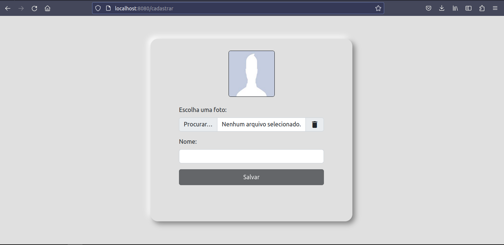
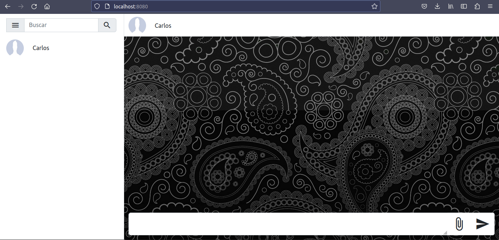
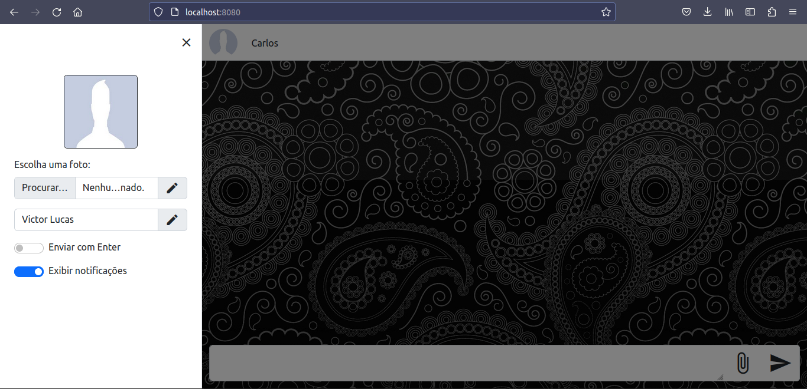
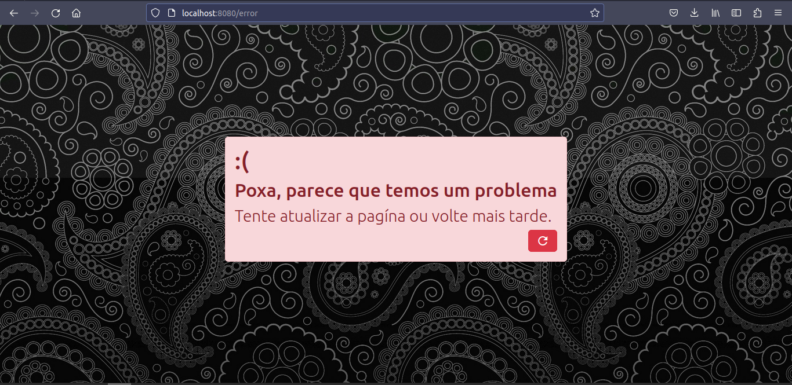

<h1 align='center'>Webchat com Ratchet e VueJs</h1>
<h2>
    Um chat simples com envio de arquivos leves usando <a href="http://socketo.me/">Ratchet</a> e <a href="https://vuejs.org/">VueJs</a>.    
</h2>
<ul>
    <li><a href="#about">Sobre</a></li>
    <li><a href="#necessary">Programas Necessários</a></li>
    <li><a href="#dependency">Instalação de dependências</a></li>
    <li><a href="#execution">Execução</a></li>
    <li>
        <a href="#communication">Comunicação</a>
        <ul>
            <li><a href="#sendMessage">Envio de mensagens</a></li>
            <li><a href="#response">Respostas</a></li>
            <li><a href="#error">Erros</a></li>
        </ul>
    </li>    
    <li><a href="#image">Imagens</a></li>
</ul>

<h2 id="about">Sobre</h2>

    Esse webchat foi desenvolvido com a finalidade de colocar em pratica algumas das tecnologias que venho estudando, nele contém todas as funcionalidas necessárias para o funcionamento de um simples chat. Fique a vontade para testar, brincar e quebrálo. Caso queria usar o websocket-server em seu front-end, basta seguir o <a href="#communication">padrão de comunicação</a>. 
    Obs: Não recomendo o uso desse webchat para algo a mais do que um teste.

<h2 id="necessary">Programas Necessários</h2>
<ul>
    <li>
        <b>PHP:</b> Para iniciar o websocker-server é necessário ter o php instalado em sua máquina. A versão ultilizada durante o desenvolvimento desse projeto foi a <b>7.4.3</b>
    </li>
    <li>
        <b>Composer:</b> O websocker-server conta com algumas dependencias como o <a href="http://socketo.me/">Websocket Ratchet</a>. Para realizar a instalação dessas dependências será necessário ter o <a href="getcomposer.org">composer</a> em sua máquina. A versão ultilizada durante o desenvolvimento desse projeto foi a <b>2.4.2</b>
    </li>
    <li>
        <b>NodeJS:</b> Para iniciar o http-server é necessário ter o NodeJs instalado em sua máquina. A versão ultilizada durante o desenvolvimento desse projeto foi a <b>16.13.1</b>
    </li>
</ul>

<h2 id="dependency">Instalação de dependências</h2>

    É necessária a instalação de alguns pacotes para o funcionamento do webchat. Para realizar essa instalação basta realizar os seguintes comandos:

    websocket: cd websocket && composer install
    webchat: cd webchat && npm install

<h2 id="execution">Execução</h2>

    Para iniciar o <b>websocket<b> basta digitar o seguinte comando no seu terminal:    
    <pre>php websocket/index.php</pre>    
    Existem diversas alternativas para iniciar o webchat, uma delas seria utilizando o servidor embutido do php:
    <pre>php -S localhost:8080 -t webchat/dist/</pre>
    Outra alternativa seria utilizar o <a href="https://expressjs.com">express</a> para subir a aplicação, um pequeno exemplo disso pode ser encontrado em "/webchat/server.js": 
    <pre>node webchat/server.js</pre>
    <pre>OBS: Caso queira alterar a url de conexão com websocket, basta entrar em: "webchat/src/store/default/state.js"</pre>

<h2 id="communication">Comunicação</h2>
A comunicação entre o cliente e o servidor é realizada atráves de um json. A carga utíl desse json deve ter o tipo de mensagem é o seu valor. 
Ex: 
<pre>
{
    type: 'message'
    data: {
        from: 19, 
        to: 10,
        id: 1000,
        format: 'text',
        value: 'Oie'
        hour: '14:21'
    }    
}
</pre>

<h3 id="sendMessage">Envio de mensagens:</h3> 

<ul>
    <li>connection: Para se conectar ao chat</li>
    <li>update: Para atualizar os dados do usuário</li>
    <li>message: Para enviar uma mensagem</li>
    <li>edit: Para editar uma mensagem</li>
    <li>delete: Para deletar uma mensagem</li>
</ul>

Cada tipo de mensagem espera receber um conjunto de dados, os campos desses dados possuem um tipo e uma obrigatoriedade. Os arquivos devem ter no máximo 10mb e serem enviados do formato base64: 

<pre>
connection: {
    name: [string, required],
    image: [string, optional] 
}        
update: { 
    from: [int, required],
    field: [string, required],
    value: [string, required] 
}
message: {
    id: [int, required], //referente ao id da mensagem
    from: [int, required],
    to: [int, required],
    format: [string, required],
    value: [string, required], 
    hour: [string, required] 
} 
edit: { 
    id: [int, required], //referente ao id da mensagem 
    from: [int, required], 
    to: [int, required], 
    value: [string, required]
},         
delete: {
    id: [int, required], //referente ao id da mensagem
    from: [int, required], 
    to: [int, required], 
}
</pre>

<h3 id="response">Respostas</h3>
Assim como as mensagens enviadas as resposta também possuem um tipo e uma carga útil. 
Ex:
<pre>
{
    type: 'connected'
    data: {
        from: 213,
        name: "Carlos Da Silva"
        image: "data/image;base64"        
    }    
}
</pre>

Tipos de respostas:
<ul>    
    <li>
        <b>success</b>: A conexão foi realizada com successo
    </li>
    <li>
        <b>registered</b>: Usuário registrado
    </li>    
    <li>
        <b>connected</b>: Nova conexão ao chat
    </li>
    <li>
        <b>update</b>: Usuário atualizou seus dados 
    </li>
    <li>
        <b>unconnected</b>: Usuário se desconectou do chat
    </li>
    <li>
        <b>message</b>: Recebimento de mensagem
    </li>
    <li>
        <b>edit</b>: Mensagem editada
    </li>
    <li>
        <b>delete</b>: Mensagem apagada
    </li>
    <li>
        <b>error</b>: Quando a carga útil é invalida ou ocorre algum erro interno
    </li>
</ul>        
Ex:
<pre>
success: {    
    message: "successful connection" 
}        
registered: {     
    id: your id,
    users: [
        { id: 22, name: "Pedro", image:"data/image;base64" },
        { id: 24, name: "Carlos", image:"data/image;base64" }            
    ]           
}
connected: {        
    id: 45,
    name: "Lucas",
    image: "data/image;base64"    
} 
update: {        
    from: 45,
    filde: "image",
    value: "data/image;base64"    
} 
unconnected: {
    id: user id
}
message: {
    id: 2123
    from: 12,
    to: 14,
    format: "text",
    value: "Olá", 
    hour: "15:04" 
} 
edit: {
    id: 2123
    from: 12,
    to: 14,    
    value: "Olá, Tudo bem?",     
}
delete: {
    id: 2123
    from: 12,
    to: 14,  
}
error: {
    code: 1007,
    message: "The structure does not match"
}
</pre>

<h3 id="error">Erros</h3>
A maioria dos erros irão ocorrer pela estrutura inválida da carga útil, as mensagens que você vai recebor por erro do client são:
<ul>
    <li>
        Failed to register user: Não for possível registrar um usuário    
    </li>
    <li>
        User integrity violation: O from não corresponder ao id do usuário
    </li>
    <li>
        Many messages in a short period of time: Quando houver vários envios em um curto espaço de tempo
    </li>
    <li>
        The structure does not match: A estrutura da carga útil é inválida
    </li>
    <li>
        Undefined or invalid type: O tipo de mensagem não for definido
    </li>
    <li>
        Undefined or invalid data: A data não corresponder ao tipo de mensagem
    </li>
    <li>
        The given data type is not supported: O tipo de dado enviado não corresponde ao esperado
    </li>
</ul>    

<h2 id="image">Imagens</h2>
 
 
 
